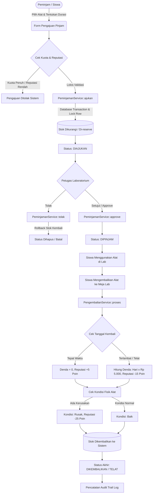

# DOKUMENTASI LENGKAP: ALUR, LOGIKA SISTEM, DAN TEKNOLOGI
## SiPinjam — Sistem Manajemen Inventaris & Peminjaman Alat Laboratorium
**SMKN 7 Baleendah • Bandung, Jawa Barat**

---

## DAFTAR ISI
1. [Gambaran Umum Sistem](#1-gambaran-umum-sistem)
2. [Teknologi yang Digunakan (Tech Stack)](#2-teknologi-yang-digunakan-tech-stack)
3. [Arsitektur & Hak Akses (Role-Based Access Control)](#3-arsitektur--hak-akses-role-based-access-control)
4. [Struktur Basis Data & Entitas](#4-struktur-basis-data--entitas)
5. [Alur Bisnis Utama (End-to-End Workflow)](#5-alur-bisnis-utama-end-to-end-workflow)
6. [Bedah Logika Bisnis (Core Business Logics)](#6-bedah-logika-bisnis-core-business-logics)
   - [6.1 Logika Manajemen Stok & Anti Race-Condition](#61-logika-manajemen-stok--anti-race-condition)
   - [6.2 Logika Perhitungan Denda Keterlambatan](#62-logika-perhitungan-denda-keterlambatan)
   - [6.3 Logika Sistem Reputasi & Gamifikasi Peminjam](#63-logika-sistem-reputasi--gamifikasi-peminjam)
   - [6.4 Logika Asisten AI (Google Gemini Context Grounding)](#64-logika-asisten-ai-google-gemini-context-grounding)
   - [6.5 Logika Analitik Tingkat Eksekutif](#65-logika-analitik-tingkat-eksekutif)
   - [6.6 Logika Keamanan Laporan, Digital Checksum & Watermark](#66-logika-keamanan-laporan-digital-checksum--watermark)
   - [6.7 Logika Audit Trail (Log Aktivitas)](#67-logika-audit-trail-log-aktivitas)
7. [Penanganan Error & Validasi](#7-penanganan-error--validasi)

---

## 1. Gambaran Umum Sistem

**SiPinjam** adalah sistem informasi berbasis web enterprise modern yang dirancang untuk mengatasi permasalahan pencatatan manual peminjaman alat praktik dan laboratorium di lingkungan sekolah menengah kejuruan (SMKN 7 Baleendah). 

Sistem ini mentransformasikan alur kerja laboratorium menjadi terpusat, transparan, dan akuntabel melalui fitur-fitur mutakhir:
- **Katalog Aset & Stok Real-Time**: Informasi ketersediaan dan status fisik alat (baik, rusak, perbaikan).
- **Alur Peminjaman & Pengembalian Terkontrol**: Menjamin stok tidak mengalami bentrok (*race condition*).
- **Kecerdasan Buatan (AI Assistant)**: Menggunakan Google Gemini yang ditanamkan konteks inventaris lab dan SOP sekolah secara *grounded*.
- **Gamifikasi Reputasi Peminjam**: Mencegah siswa mengembalikan alat terlambat atau rusak melalui sistem poin dan kuota dinamis.
- **Analitik Eksekutif**: Dashboard visual bagi pengambil keputusan sekolah untuk memantau performa inventaris.
- **Dokumen Terverifikasi & Anti Pemalsuan**: Laporan cetak dan ekspor berbekal stempel digital SHA-256 checksum dan watermark.

---

## 2. Teknologi yang Digunakan (Tech Stack)

### 2.1 Backend & Framework
* **PHP 8.2+ / 8.4**: Bahasa pemrograman server-side dengan pengetikan statis (*type hinting*) dan performa tinggi.
* **Laravel Framework**: Framework PHP berstandar enterprise yang mengusung arsitektur MVC (*Model-View-Controller*) dan *Service Layer Pattern*.
* **Laravel Eloquent ORM**: Abstraksi basis data relasional berorientasi objek yang dilengkapi *Pessimistic Locking* dan *Database Transactions*.
* **Laravel Sanctum**: Sistem otentikasi berbasis token API yang aman dan efisien.

### 2.2 Frontend & UI/UX
* **Tailwind CSS**: Utility-first CSS framework untuk menghasilkan antarmuka modern bertema *Dark Fire Slate Glassmorphism*.
* **Blade Templating Engine**: Mesin template bawaan Laravel untuk modularitas komponen, slot layout, dan kontrol hak akses UI.
* **Vite 7**: Build tool frontend generasi terbaru untuk bundling asset CSS & JavaScript secara instan (*Hot Module Replacement*).
* **Anime.js**: Library animasi JavaScript untuk efek mikro-interaksi (*glow orbs*, transisi kartu statistik, dan aksen dinamis).
* **Chart.js**: Library visualisasi data interaktif untuk merender grafik utilisasi alat dan tren peminjaman pada Analitik Eksekutif.

### 2.3 Pelaporan & Dokumen (Reporting Engine)
* **DomPDF**: Engine rendering HTML/CSS ke dokumen PDF dengan layout kustom A4 Landscape, header resmi kop surat, dan watermark background.
* **OpenSpout v5 (`openspout/openspout`)**: Library modern pembaca/penulis spreadsheet format `.xlsx`. Dirancang berbasis *memory-efficient streaming* sehingga mampu mengekspor ribuan data tanpa menghabiskan memory RAM server (*anti out-of-memory*).

### 2.4 Kecerdasan Buatan (Artificial Intelligence)
* **Google Gemini API (`gemini-flash-latest` / 1.5 Flash)**: Model bahasa multimodal dari Google AI Studio dengan latensi rendah dan pemahaman instruksi yang presisi.
* **Context Grounding & Prompt Engineering**: Mekanisme penyuntikan data inventaris laboratorium dan tata tertib sekolah ke dalam *System Instruction* AI untuk memastikan jawaban selalu berada di dalam koridor laboratorium.

### 2.5 Basis Data & Infrastruktur
* **MySQL 8 (InnoDB)**: Basis data relasional dengan integritas relasi *Foreign Key*, *Strict Mode*, dan *ACID Compliance*.
* **Docker & Docker Compose**: Kontainerisasi lingkungan aplikasi (`laravel-api`, `mysql-server`, `phpmyadmin`) untuk menjamin konsistensi sistem di lingkungan development maupun produksi.

---

## 3. Arsitektur & Hak Akses (Role-Based Access Control)

Sistem menerapkan prinsip *Least Privilege* dengan membagi pengguna ke dalam 3 peran:

```
┌────────────────────────────────────────────────────────────────────────┐
│                                 USERS                                  │
├───────────────────┬────────────────────────────┬───────────────────────┤
│   1. ADMIN        │   2. PETUGAS (LABORAN)     │   3. PEMINJAM (SISWA) │
├───────────────────┼────────────────────────────┼───────────────────────┤
│ • Manajemen User  │ • Verifikasi Pengajuan     │ • Jelajah Katalog Alat│
│ • Kelola Kategori │ • Serah Terima Alat        │ • Pengajuan Peminjaman│
│ • Kelola Alat     │ • Proses Pengembalian      │ • Pantau Kuota & Tier │
│ • Analitik        │ • Rekap Denda Kas          │ • Riwayat Peminjaman  │
│ • Cetak Laporan   │ • Cetak Laporan (PDF/XLSX) │ • Tanya Jawab via AI  │
│ • Audit Log       │ • Pemantauan Inventaris    │ • Kartu Reputasi      │
└───────────────────┴────────────────────────────┴───────────────────────┘
```

Sistem membedakan routing menggunakan middleware otentikasi role:
- Prefix `/admin/*` hanya dapat diakses pengguna dengan `role = 'admin'`.
- Prefix `/petugas/*` hanya dapat diakses pengguna dengan `role = 'petugas'`.
- Prefix `/peminjam/*` dapat diakses pengguna dengan `role = 'peminjam'`.

---

## 4. Struktur Basis Data & Entitas

Sistem dibangun di atas arsitektur basis data relasional yang saling mengikat (*Foreign Key Constraints*):

```
 users
  ├── id (PK)
  ├── name, email, password, role (admin | petugas | peminjam)
  ├── skor_reputasi (INTEGER, default: 100)
  ├── no_hp, alamat, foto_profile
  └── timestamps
       │ 1
       │
       │ N
 peminjaman ─────────────────────────────────────────┐ 1
  ├── id (PK)                                        │
  ├── user_id (FK -> users.id)                       │ 1
  ├── tgl_pinjam (DATE)                              │
  ├── tgl_kembali_plan (DATE)                        │
  ├── status ('diajukan' | 'dipinjam' |              │
  │           'dikembalikan' | 'telat')              │
  └── timestamps                                     │
       │ 1                                           │
       │                                             │
       │ N                                           ▼
 detail_pinjam                           pengembalian
  ├── id (PK)                             ├── id (PK)
  ├── peminjaman_id (FK -> peminjaman.id) ├── peminjaman_id (FK UNIQUE)
  ├── alat_id (FK -> alat.id)             ├── tgl_kembali (DATE)
  ├── jumlah (INTEGER)                    ├── kondisi_kembali ('baik'|'rusak'|'perbaikan')
  └── timestamps                          ├── denda (DECIMAL 12,2)
       │ N                                ├── petugas_id (FK -> users.id)
       │                                  └── timestamps
       │ 1
 alat ◄─────────────────┐ N
  ├── id (PK)           │
  ├── kategori_id (FK)──┘ 1 (kategori)
  ├── nama_alat, deskripsi, gambar
  ├── stok (INTEGER, CHECK >= 0)
  ├── status_kondisi ('baik' | 'rusak' | 'perbaikan')
  └── timestamps

 log_aktivitas
  ├── id (PK)
  ├── user_id (FK nullable -> users.id)
  ├── aktivitas (VARCHAR)
  ├── keterangan (TEXT)
  └── created_at (TIMESTAMP)
```

---

## 5. Alur Bisnis Utama (End-to-End Workflow)



---

## 6. Bedah Logika Bisnis (Core Business Logics)

### 6.1 Logika Manajemen Stok & Anti Race-Condition
* **Permasalahan**: Jika ada dua siswa yang mengklik tombol pinjam untuk alat yang tersisa 1 unit pada milidetik yang sama, salah satu tidak boleh mendapatkan stok negatif.
* **Solusi**: Diimplementasikan pada `PeminjamanService::ajukan()`:
  1. Membuka `DB::beginTransaction()`.
  2. Menggunakan klausa **Pessimistic Locking**: `Alat::where('id', $id)->lockForUpdate()->first()`.
  3. Memvalidasi ketersediaan stok fisik: `if ($alat->stok < $jumlah) throw new Exception(...)`.
  4. Stok langsung didecrement saat peminjaman diajukan (*reservation pattern*).
  5. Jika transaksi gagal, `DB::rollBack()` mengembalikan status semula secara utuh. Jika petugas menolak (*reject*), stok di-increment kembali.

### 6.2 Logika Perhitungan Denda Keterlambatan
* **Formula Perhitungan**:
  $$\text{Hari Terlambat} = \max\left(0, \, \text{Tanggal Aktual Kembali} - \text{Tanggal Rencana Kembali}\right)$$
  $$\text{Total Denda} = \text{Hari Terlambat} \times \text{Tarif Harian (Rp 5.000)}$$
* **Implementasi Kode**:
  ```php
  $tglRencana = Carbon::parse($peminjaman->tgl_kembali_plan)->startOfDay();
  $tglAktual = Carbon::parse($request->tgl_kembali)->startOfDay();
  
  $hariTelat = $tglAktual->greaterThan($tglRencana) 
      ? $tglRencana->diffInDays($tglAktual) 
      : 0;
      
  $tarifDenda = 5000; // Rp 5.000 per hari
  $denda = $hariTelat * $tarifDenda;
  $statusPeminjaman = $hariTelat > 0 ? 'telat' : 'dikembalikan';
  ```

### 6.3 Logika Sistem Reputasi & Gamifikasi Peminjam
Untuk menumbuhkan rasa tanggung jawab siswa terhadap aset sekolah, diterapkan sistem skor reputasi (skor awal: **100 poin**):
* **Aturan Poin (Delta Reputasi)**:
  * Mengembalikan tepat waktu & kondisi baik: **+5 poin** (Reward ketaatan).
  * Terlambat mengembalikan: **-15 poin** (Penalti kedisiplinan).
  * Mengembalikan dalam kondisi rusak/cacat: **-25 poin** (Penalti kelalaian fisik).
* **Tier & Kuota Peminjaman Dinamis**:
  
  | Skor Reputasi | Nama Tier | Badge | Maksimal Kuota Pinjam | Deskripsi Hak Akses |
  | :--- | :--- | :---: | :---: | :--- |
  | **$\ge$ 150** | **VIP Legend** | 👑 | **6 unit** | Akses prioritas alat lab tingkat lanjut |
  | **120 – 149** | **Master** | 🏆 | **5 unit** | Kuota di atas rata-rata |
  | **90 – 119** | **Reliable (Normal)** | ⭐ | **3 unit** | Kuota standar siswa reguler |
  | **60 – 89** | **Caution (Perhatian)**| ⚠️ | **2 unit** | Peringatan catatan keterlambatan |
  | **$<$ 60** | **Suspended (Terbatas)**| 🚫 | **1 unit** | Akun dalam masa percobaan laboratorium |

* **Proteksi Validasi**: Saat siswa hendak mengajukan peminjaman, `PeminjamanService` memvalidasi total alat yang sedang aktif dipinjam + alat yang baru diajukan tidak boleh melampaui `kuota_max` dari tier reputasi siswa saat itu.

### 6.4 Logika Asisten AI (Google Gemini Context Grounding)
* **Kebutuhan**: AI asisten laboratorium harus menjawab pertanyaan tentang inventaris lab SMKN 7 Baleendah secara tepat, dan dilarang keras berhalusinasi atau melenceng membahas hal di luar laboratorium (politik, gosip, dsb.).
* **Teknik Grounding**:
  1. Saat controller menerima pesan dari user, sistem mengkueri database real-time:
     - Daftar nama alat yang tersedia, jumlah stok, kategori, dan kondisi fisiknya.
     - SOP Peminjaman (jam operasional 07.30 - 16.00 WIB, denda Rp 5.000/hari, syarat persetujuan laboran).
  2. Menyusun **System Prompt Kustom** ke Google Gemini API:
     ```text
     Kamu adalah SiPinjam AI, asisten resmi laboratorium SMKN 7 Baleendah.
     DATA INVENTARIS REALTIME:
     - [Kamera Sony]: 2 unit tersedia
     - [Multimeter Sanwa]: 5 unit tersedia
     ...
     ATURAN MUTLAK:
     1. Jawab HANYA pertanyaan seputar ketersediaan alat, SOP peminjaman, dan panduan lab.
     2. Jika user bertanya hal di luar inventaris/lab, tolak dengan sopan: 'Maaf, saya hanya bertugas membantu seputar laboratorium SMKN 7 Baleendah.'
     ```
  3. Mengirimkan payload via HTTP POST ke endpoint resmi:
     `https://generativelanguage.googleapis.com/v1beta/models/gemini-flash-latest:generateContent?key={API_KEY}`.

### 6.5 Logika Analitik Tingkat Eksekutif
Dashboard Analitik `/admin/analitik` menyajikan metrik penting untuk bahan rapat manajemen sekolah:
* **KPI Tingkat Keterlambatan (*Overdue Rate*)**:
  $$\text{Persentase Keterlambatan} = \left( \frac{\text{Total Peminjaman Status Telat}}{\text{Total Transaksi Selesai}} \right) \times 100\%$$
* **Peralatan Paling Populer (*Top Utilized Equipment*)**: Agregasi `SUM(detail_pinjam.jumlah)` yang digolongkan berdasarkan `alat_id` dengan pengurutan `DESC` limit 5.
* **Akumulasi Kas Denda**: Rekapitulasi `SUM(pengembalian.denda)` bulanan untuk transparansi penerimaan kas bengkel/lab.
* **Chart Rendering**: Data diagregasi di backend lalu dioper ke Blade untuk digambar oleh `Chart.js` (grafik batang horizontal untuk utilisasi dan grafik donat untuk status kondisi alat).

### 6.6 Logika Keamanan Laporan, Digital Checksum & Watermark
Guna mencegah pemalsuan dokumen cetak hasil ekspor:
* **Nomor Dokumen Terenkripsi**:
  Format: `SPJ-DOC-YYYYMMDD-[HASH-6-DIGIT]`.
* **Digital Checksum SHA-256**:
  $$\text{Checksum} = \text{SHA256}(\text{DocID} + \text{Timestamp} + \text{TotalData} + \text{AppKey})$$
  Kode unik 64-karakter dicetak pada footer laporan. Jika ada pihak yang mengubah angka transaksi di kertas atau PDF secara ilegal, checksum tidak akan cocok saat dicek ulang pada database.
* **Translucent Watermark**: Latar belakang cetak disisipi teks diagonal semi-transparan `SIPINJAM • SMKN 7 BALEENDAH • DOKUMEN RESMI TERVERIFIKASI`.
* **Responsive Multi-Page CSS Print**:
  ```css
  @page { size: landscape; margin: 10mm 12mm; }
  * { -webkit-print-color-adjust: exact !important; }
  thead { display: table-header-group !important; }
  tr { page-break-inside: avoid !important; }
  ```
  Menjamin tabel dicetak horizontal (landscape), warna lencana (*badges*) tidak hilang saat diprint, dan header tabel berulang otomatis jika data mencapai halaman 2 atau lebih.

### 6.7 Logika Audit Trail (Log Aktivitas)
Setiap tindakan penting (*create, update, delete, approve, reject, return*) memicu pencatatan otomatis ke tabel `log_aktivitas`:
* Format data: `user_id` pelaku, nama aksi (`aktivitas`), rincian data sebelum/sesudah (`keterangan`), dan timestamp presisi milidetik.
* Membantu administrator mengetahui siapa yang menyetujui peminjaman alat tertentu atau siapa yang mengubah stok barang jika terjadi selisih.

---

## 7. Penanganan Error & Validasi

Sistem dirancang dengan pertahanan berlapis:
1. **Form Request Validation**: Setiap input disaring melalui rules Laravel (`required`, `integer`, `min:1`, `date`, `after_or_equal:tgl_pinjam`).
2. **Database Constraints**: Kolom `stok` di tabel alat dilindungi klausul SQL `CHECK (stok >= 0)`, sehingga secara fisik basis data menolak pengurangan stok jika hasilnya negatif.
3. **Database Transactions**: Seluruh mutasi yang melibatkan lebih dari satu tabel (peminjaman + detail pinjam + pengurangan stok) dibungkus dalam blok `DB::transaction()`. Jika ada satu query gagal, seluruh operasi dibatalkan seketika (*atomic operation*).
4. **Graceful Fallback**: Jika koneksi API Gemini terputus atau kuota Google AI Studio habis, sistem AI memberikan respons cadangan cerdas tanpa memutus pengalaman pengguna (*no white-screen crash*).

---

> Dokumen ini dirancang sebagai panduan teknis resmi, acuan pengujian sistem (*Uji Kompetensi Keahlian / UJIKOM*), serta dokumentasi arsitektur perangkat lunak SiPinjam SMKN 7 Baleendah.
